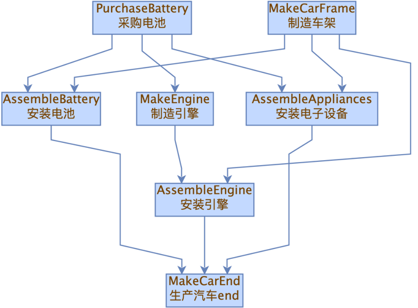

# 🔧 引言

该如何高效开发维护复杂服务呢？ 不外乎将复杂服务，按业务领域拆解为一系列高内聚职责单一的组件（类或方法）。

但拆解的大量组件需要聚合执行以构成整体服务，所以需要额外的编排，以控制组件的执行顺序、保存组件的执行结果、在组件间传递数据等。

一般都是硬编码实现编排的。但是会遇到一些问题：

1. 复杂服务，拆解的组件数量会比较夸张，编排代码规模会快速膨胀，难开发。
2. 这种硬编码又导致耦合严重，当流程改变需要调整执行顺序、改变数据依赖、增加或删除组件时，难维护。
3. 使用并发或异步编程时，编排API复杂，硬编码的开发维护难度更高，而且需要仔细设计才能实现最优并发。

更好的方式是使用`流程引擎`，能够根据业务流程模型（即组件执行顺序），自动得将组件组合执行，构成整体服务。

但是、市场上的`流程引擎`都太重了，设计复杂，学习、使用成本太高了。

# 🔧 框架介绍

AutoCompose是一款单事件驱动（无状态）的流程引擎。 

使用本框架，能够轻松实现复杂服务的自动化编排【零配置、零编码】，能够显著提高开发维护效率。

支持同步编程、异步编程（已支持CompletableFuture、Reactor、ListenableFuture）。

AutoCompose核心特点是：

> 通过解析代码的方式（零配置：不需要配置维护编排规则文件），
> 
> 自动得（零编码）获取业务流程模型，
> 
> 自动得（零编码）按照模型将组件（以最优并发策略）组合执行。

一切都是自动的（显著减少开发维护工作量），这也是本框架命名为`自动编排`的初衷。

# ☘ ️使用收益

1. 复杂业务拆解为组件化的代码结构，高内聚低耦合带来`可读性、可扩展性`上的显著提升。
2. `只需实现组件，不再需要开发维护编排代码`。组件间依赖管理、执行控制、数据传递由AutoCompose框架自动完成。
3. `显著简化异步编程`。异步编程的最大难点就是编排代码的开发维护，使用AutoCompose后，同步编程（干掉99%异步编程代码）、异步执行。
4. 自动生成`可视化的业务流程图`（如下图）。能够直观的展示整个业务模型。例如：
   <br/>

# 👥 使用说明

## 一、项目要求

使用本框架需要是JDK8及以上的Spring项目

## 二、引入依赖

```
<dependency>
    <groupId>io.github.heartcraft</groupId>
    <artifactId>auto-compose-core</artifactId>
    <version>1.0.0</version>
</dependency>

* SpringBoot项目自动装配
* 非SpringBoot项目，可使用@EnableAutoCompose注解装配
```

## 三、开发说明

分为三个步骤：

### （一）组件开发

组件 == 实现了AutoComposable接口的Bean对象。（组件应该职责单一，对应业务流程中的一步操作）。

1. 【必须】组件均需实现AutoComposable接口。框架目前提供了如下4个扩展接口，根据使用的编程方式对应选择即可：

|        同步编程         | CompletableFuture异步编程  |      Reactor异步编程       | ListenableFuture异步编程  |
|:-------------------:|:----------------------:|:----------------------:|:---------------------:|
| SyncAutoComposable  |    CfAutoComposable    | ReactorAutoComposable  |   LfAutoComposable    |

> CfAutoComposable、ReactorAutoComposable、LfAutoComposable接口均提供了Sync子接口，同步编程异步执行。

2. 组件间的数据传递。组件的执行结果会被框架自动缓存，其他组件可以通过`getExecuteResult`方法获取其执行结果。
3. 组件的执行顺序。组件间的数据传递关系 => 组件间的依赖注入关系 => (解析代码获得)业务流程模型 => 组件的执行顺序。  
4. 【可选】使用`@AutoComposableBeanDesc`注解组件，可在此注解中描述组件的业务逻辑，描述内容会用于`可视化的业务流程图`展示，不影响程序的执行。

以CompletableFuture做个🌰：

```java
@Component
@AutoComposableBeanDesc("组件A的业务逻辑说明")
public class A implements CfAutoComposable<String> {

    @Override
    public CompletableFuture<String> execute() {
        return CompletableFuture.supplyAsync(() -> "a",
                TtlExecutors.getTtlExecutor(ForkJoinPool.commonPool()));
    }
}


@Component
@AutoComposableBeanDesc("组件B的业务逻辑说明")
public class B implements CfAutoComposable.Sync<String> {

    // 组件B中注入了组件A。AutoCompose框架会控制A先执行，A异步执行完成后，B再执行。
    @Autowired
    private A a;

    @Override
    public String syncExecute() {
        // 获取组件A的执行结果（组件间的数据传递）
        String aResult = a.getExecuteResult(); // "a"

        return String.format("b（%s）", aResult); // "b（a）"
    }
}
```

### （二）编排执行

使用`AutoComposeUtils.execute`方法，入参为根节点组件（最终执行的组件），返回自动编排执行结果。

```java
@Component
public class Service {

    @Autowired
    private AutoComposeUtils autoComposeUtils;

    @Autowired
    private B b;

    public CompletableFuture<String> execute() {
        // 自动编排执行，入参为根节点组件（最终执行的组件）
        return autoComposeUtils.execute(b);
    }
}
```

### （三）上下文数据传递

使用`ContextHolder`接口，快速实现上下文数据传递。

```java
@Component
public class MyContextHolder implements ContextHolder<MyContext> {
}

@Component
public class Service {

    @Autowired
    private AutoComposeUtils autoComposeUtils;

    @Autowired
    MyContextHolder myContextHolder;

    @Autowired
    private B b;

    public CompletableFuture<String> execute() {
        // 全局上下文数据set
        myContextHolder.set(new MyContext());
        
        return autoComposeUtils.execute(b);
    }
}

@Component
@AutoComposableBeanDesc("组件A的业务逻辑说明")
public class A implements CfAutoComposable<String> {

    @Autowired
    MyContextHolder myContextHolder;

    @Override
    public CompletableFuture<String> execute() {
        // 全局上下文数据get
        MyContext myContext = myContextHolder.get();

        return CompletableFuture.supplyAsync(() -> String.format("a(%s)", myContext.toString()),
                TtlExecutors.getTtlExecutor(ForkJoinPool.commonPool()));
    }
}
```

## 四、注意事项

1. 框架不会切换线程，而是把是否切换线程的选择，交给开发者在组件实现时自行控制。耗时长的组件，需要与其他组件并发执行的，需要自定义切换执行线程。
2. 默认的缓存数据实现`TransmittableThreadLocalDataHolder.class`，是基于[TransmittableThreadLocal（TTL）](https://github.com/alibaba/transmittable-thread-local)实现的，所以使用此默认缓存实现时，需要注意：
    * 一定要遵循TTL的使用规范，[保证线程池中传递值](https://github.com/alibaba/transmittable-thread-local#2-%E4%BF%9D%E8%AF%81%E7%BA%BF%E7%A8%8B%E6%B1%A0%E4%B8%AD%E4%BC%A0%E9%80%92%E5%80%BC)。
    * 一定要在每次请求处理前，清理掉TTL中的历史数据（调用`TransmittableThreadLocalDataHolder.reset()`）。 建议使用Filter实现（Servlet，baiji、dubbo等RPC框架都有其自定义的Filter api，可根据使用框架对应实现）
3. 可以自定义缓存数据实现。（实现`DataHolder`接口，通过`DataHolderFactory.registerDataHolder(DataHolder holder)`注册）。

## 五、其他API说明

1. 可覆盖`AutoComposable`默认提供的`close`,`getDependentBeans`方法，实现自定义执行链路控制。
2. `AutoComposableDependenciesCache.INSTANCE.generateDependenciesImg()`可生成依赖关系图。
3. `AutoComposableDependenciesCache.INSTANCE.generateDependenciesString()`可在控制台打印依赖关系。
4. `AutoComposableDependenciesCache.INSTANCE.getDependencies()`有2个重载方法，无参数方法获取全部组件依赖关系数据，有参数方法获取指定组件的依赖关系数据。

## 更多代码示例

### （一）同步编程

```java
@Component
public class A implements SyncAutoComposable<String> {

    @Override
    public String execute() {
        // 长耗时的IO调用
        return RpcClient.get();
    }

    // 执行耗时长的组件可自定义切换执行线程，以实现与其他组件并发执行
    @Override
    public Executor getExecutor() {
        return TtlExecutors.getTtlExecutor(ForkJoinPool.commonPool());
    }
}

@Component
public class B implements SyncAutoComposable<String> {

    @Autowired
    private A a;

    @Override
    public String execute() {
        // 获取组件A的执行结果（组件间的数据传递）
        String aResult = a.getExecuteResult();
        
        return String.format("b（%s）", aResult);
    }
}
```

2. 编排执行

```java
@Component
public class Service {

    @Autowired
    private AutoComposeUtils autoComposeUtils;

    @Autowired
    private B b;

    public String execute() {
        // 自动编排执行，入参为根节点组件（最终执行的组件）
        return autoComposeUtils.execute(b);
    }
}
```

### （二）Reactor异步编程

（本项目中提供了一个Reactor项目示例，可找到`AutoComposeApplication.java`查看）

1. 组件开发

```java
@Component
public class A implements ReactorAutoComposable<String> {

    @Override
    public Mono<String> execute() {
        return Mono.fromCallable(() -> "a")
                .subscribeOn(Schedulers.fromExecutor(TtlExecutors.getTtlExecutor(ForkJoinPool.commonPool())));
    }
}


@Component
public class B implements ReactorAutoComposable.Sync<String> {

    @Autowired
    private A a;

    @Override
    public String syncExecute() {
        // 获取组件A的执行结果（组件间的数据传递）
        String aResult = a.getExecuteResult();
        
        return String.format("b（%s）", aResult);
    }
}
```

2. 编排执行

```java

@Component
public class Service {

    @Autowired
    private AutoComposeUtils autoComposeUtils;

    @Autowired
    private B b;

    public Mono<String> execute() {
        // 自动编排执行，入参为根节点组件（最终执行的组件）
        return autoComposeUtils.execute(b);
    }
}
```

# 🔧 实现原理

实现流程引擎需要满足2个条件：

1. 所有组件的执行方法要有相同的函数签名，才能被引擎框架调用
2. 获取业务流程模型（即组件的执行顺序），引擎框架控制组件按序执行

## 一、相同的函数签名

实现方案显而易见：定义组件接口（其中定义执行函数签名），所有组件均实现此接口。

相同的函数签名，就不能随意增改出参、入参，组件间数据传递会麻烦一些，如下是一些解决办法：

### （一）自定义数据上下文对象传递数据

这是最常规的解决方案：自定义数据上下文对象，组件从数据上下文对象读取数据，将执行的结果也写入数据上下文对象。
（开源框架[LiteFlow数据上下文](https://liteflow.cc/pages/74b4bf/)用的就是此方案）

此方案的缺点是：

* 业务场景复杂后，组件间传递的数据非常复杂，全部放在一个数据上下文对象中过于庞大不易维护，多个数据上下文对象又会非常混乱不方便。
* 数据上下文对象作用域太大了，项目中的任何一处都可以读写，容易被滥用。 
  当读取数据时，是不容易确定其数据状态的，尤其该数据会被多次写入、修改， 必须结合组件的执行顺序，才能确定读取时的数据状态。 
  这就给后续开发维护代码增加了困难和隐患。

### （二）自动保存与传递数据

由框架自动缓存每个组件的执行结果数据，需要使用时再从缓存中读取。

此方案避免了方案一的缺点，同时的有如下优点：

* 对开发简单友好（由框架封装数据的保存与传递）。组件之间直接依赖，数据自动传递，不需要依赖额外的数据上下文对象。
* 代码可读性好。下游组件读取到的数据，就是它依赖的组件的执行结果。

## 二、获取组件的执行顺序及执行

> 开源框架[LiteFlow](https://liteflow.cc/pages/6fa87e/#%E8%A7%84%E5%88%99%E7%BB%84%E6%88%90%E9%83%A8%E5%88%86)
> 及其他绝大部分流程引擎的办法是：维护额外的执行顺序配置文件（此方案只能称为半自动编排，因为配置文件还需要开发维护）。
>
> 这种方案有个明显缺点是：配置的执行顺序，必须与代码中组件的数据依赖关系一致，如不一致会导致执行时数据缺失而出错。而且没有手段检测这种差异，容易留下隐患。

本引擎框架的设计理念是：组件间的数据传递关系 => 组件间的依赖注入关系 => (解析代码获得)业务流程模型 => 组件的执行顺序。

解析组件间的依赖注入关系可得业务流程模型【[DAG(有向无环图)](https://zh.wikipedia.org/wiki/%E6%9C%89%E5%90%91%E6%97%A0%E7%8E%AF%E5%9B%BE)的数据结构】，后序遍历（“被依赖组件先执行”）即组件的执行顺序。

这方案也有其劣势：无法支持复杂的编排能力（如条件判断，循环等），只支持串行（A Then B）编排、并行（A 且 B）编排。
但是，串行编排、并行编排对于99%的场景已是足够，当需要更复杂的编排时硬编码即可。

# 📝 Q&A

Q1：为什么组件均要实现特定接口？

A：每个组件具有相同的函数签名，才能被引擎框架调用，这是实现自动编排的基础。

------------

Q2：是否能做配置甚至可视化配置，实时调整组件的执行顺序？

A：可以做但没必要。

组件的执行顺序，实际是组件的数据依赖关系； 当组件的数据依赖关系不变时，组件的执行顺序也不能变（除了满足交换律的极特殊场景，可以忽略）。

所以，不更改代码中组件的数据依赖关系，单独实时调整组件的执行顺序是个伪需求。而且做额外的配置使得代码与配置分离，更不利于维护。

组件依赖关系可视化（DAG图），才是真正有用的功能，本框架目前已简单实现（UI不够友好，待优化）。

------------

Q3：与开源框架[LiteFlow](https://liteflow.cc/)框架有什么区别？

A：两款框架都是解决复杂服务开发的单事件驱动（无状态）的流程引擎。

> LiteFlow的作者认为它是规则引擎，虽然有这种说法上的差异，但实际上，两者的功能、解决的问题是一样的。

AutoCompose追求简化开发提升效率，LiteFlow倾向于更灵活的的编排能力。

|        | AutoCompose                      | LiteFlow                  |
|:-------|:---------------------------------|:--------------------------|
| 学习成本   | 低（熟悉几个接口与API）                    | 高（组件接口类型多，还要学习其EL表达式写法）   |
| 使用成本   | 低（省去编排代码开发，自动组件数据传递，显著降低开发维护工作量） | 高（需要额外开发维护编排文件，需要硬编码数据传递） |
| 编排灵活性  | 低（只支持串行编排、并行编排）                  | 高（支持非常丰富灵活的编排能力）          |
| 异步编程   | 支持（显著简化异步编程，降低门槛，提高开发效率）         | 不支持                       |
| 代码可读性  | 高（逻辑都在代码里）                       | 低（必须结合代码与编排文件，才能确定实际执行逻辑） |
| 逻辑可视化  | 高（可生成业务流程图）                      | 中（可阅读编排文件）                |


# 版本更新日志：
1.0.9-NoStatus版本更新日志：
1.删除AutoComposable的getDependentBeans方法【泛型转换有问题，需要泛型擦除才能使用，且有更简单的close方法可以平替，调研目前各使用方没有使用此方法，所以做删除下线处理】
2.AutoComposableDependenciesCache中cacheMap的Value类型优化为Set类型
3.提供TtlWrappersExt类，提供wrapListenableFuture、wrapCompletableFuture方法
4.增加编排执行中数据传递丢失检测功能
5.支持SpringBoot3自动装配
6.CfAutoComposable、LfAutoComposable、ReactorAutoComposable编排接口，增加enhanceExecuteResult方法【支持异常拦截等功能扩展】

----------

1.0.8-NoStatus版本更新日志：
1. 新增LfAutoComposable接口（支持ListenableFuture）
2. 重写SyncAutoComposable接口（可自定义切换执行线程）
3. 优化ReactorAutoComposable接口（更改cache调用位置）
4. 重命名ResultHolderFactory为DataHolderFactory
5. 重命名DefaultDataHolder为TransmittableThreadLocalDataHolder
6. 优化生成的流程图（箭头方向表示为执行顺序，左右排列改为由上向下排列，提升阅读体验）

----------

禁用：1.0.7-NoStatus

----------

1.0.6-NoStatus版本更新日志：
1. 增加ResultHolderFactory.registerDataHolder(DataHolder holder)方法，支持自定义DataHolder实现。（默认提供的还是基于TTL的DataHolder实现）
2. Reactor框架同步执行支持null
3. initCacheMap初始容量优化

---------

1.0.5-NoStatus版本更新日志：
1. 增加ContextHolder接口，默认实现上下文数据存储和获取，以简化数据传递。（来自@大圣的贡献）
2. 编排执行前增加缓存清理校验，避免使用组件遗漏缓存数据清理。
3. 增加异步组件的同步执行接口。（异步项目中，绝大部分也是同步代码，但为了异步编程不得不使用异步Api。增加同步执行接口（CfAutoComposable.Sync、ReactorAutoComposable.Sync），同步编程，异步执行。

---------

1.0.4-NoStatus版本更新日志：
最低可用版本
